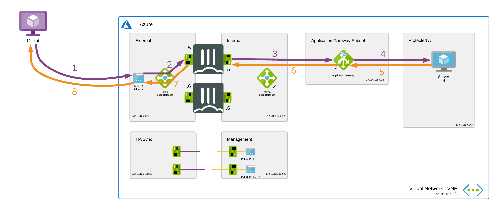

# Active/Passive High Available FortiGate pair with Azure Application Gateway and internal Azure Standard Load Balancer

# Introduction

On this webpage you can find scenarios, using the Azure Application Gateway, aimed specifically at customers who have specific security requirements such as IPS and others for their web services.

The Azure Application Gateway is a web traffic load balancer that enables you to manage traffic to your web applications. In comparison to the Azure Standard Load Balancer that operates at the transport layer (Layer 4 - TCP/UDP) and route traffic based on source IP address and port, to a destination IP address and port.
Application Gateway can make routing decisions based on additional attributes of an HTTP request, for example URI path or host headers. This type of routing is known as application layer (OSI layer 7) load balancing. Azure Application Gateway can do URL-based routing and more.

# Design

The Azure Application Gateway can be deployed together with FortiGate in several ways. These different methods will be described as scenarios. The goal of this page is to document these scenarios and provide the necessary ARM templates.
These ARM templates deploy a High Availability pair of FortiGate Next-Generation Firewalls accompanied by an Azure Application Gateway and the required infrastructure. It is based of the "Active/Passive High Available FortiGate pair with external and internal Azure Standard Load Balancer" template which can be found [here](https://github.com/40net-cloud/fortinet-azure-solutions/tree/main/FortiGate/Active-Passive-ELB-ILB). Please also review the documentation of that template for additional information and troubleshooting.

# Deployment

The FortiGate solution can be deployed using the Azure Portal or Azure CLI. There are 4 variables needed to complete kickstart the deployment. The deploy.sh script will ask them automatically. When you deploy the ARM template the Azure Portal will request the variables as a requirement.

  - PREFIX : This prefix will be added to each of the resources created by the templates for easy of use, manageability and visibility.
  - LOCATION : This is the Azure region where the deployment will be deployed
  - USERNAME : The username used to login to the FortiGate GUI and SSH management UI.
  - PASSWORD : The password used for the FortiGate GUI and SSH management UI.

## Scenario 1

In this scenario the Application Gateway will be placed in front of the FortiGates and act as an external loadbalancer. This scenario is supported with both Azure Application Gateway v1 and v2. Offloading of SSL traffic on the Azure Application Gateway is recommended.

The traffic flow will look like this:

1. The client will do the request on the frontend IP of the Azure Application Gateway. This can be a public or private frontend.
2. The Azure Application Gateway will process the traffic and send it to it's configured backend, which are the private "WAN" IP's of both FortiGates. The Azure Application Gateway will determin which FortiGate is active and which one is passive using health probes. Only the active FortiGate will process the health probes and so the Azure Application Gateway will send the request to the active FortiGate. The source IP of the traffic will be the IP of the Azure Application Gateway instance.
3. The FortiGate will have two VIPs configured. A VIP for each private IP of the FortiGate with as destination the private IP of the server.
4. On the subnet of the server there are User Defined Routes with a route that will send the reply of the server via the Azure standard internal loadbalancer.
5. The Azure standard internal loadbalancer will have an "HA ports" loadbalancing rule configured with the private "LAN" IP's of both FortiGates as backend. The Azure standard internal loadbalancer will determin which FortiGate is active and which one is passive using health probes. Only the active FortiGate will process the health probes and so the Azure standard internal loadbalancer will send the reply to the active FortiGate.
6. The active FortiGate will send the reply to the Azure Application Gateway.
7. The Azure Application Gateway will process the reply and send it to the client.

### Azure Portal

### Azure CLI

`cd ~/clouddrive/ && wget -qO- https://github.com/40net-cloud/fortinet-azure-solutions/archive/main.zip | jar x && cd ~/clouddrive/fortinet-azure-solutions-main/FortiGate/Active-Passive-ELB-ILB/ && ./deploy.sh`

This Azure ARM template will automatically deploy a full working environment containing the following components.

  - 2 FortiGate firewall's in an active/passive deployment
  - 1 Azure Application Gateway v2 for incoming webtraffic
  - 1 internal Azure Standard Load Balancer to receive all internal traffic
  - 1 VNET with 1 protected subnet, application gateway subnet and 4 subnets required for the FortiGate deployment (external, internal, ha mgmt and ha sync). If using an existing vnet, it must already have these 6 subnets
  - 5 public IPs: 1 public IP as listener on the application gateway. 2 public IP as WAN IP and 2 public IP for management access.
  - User Defined Routes (UDR) for the protected subnet.

This ARM template can also be used to extend or customized based on your requirements. Additional subnets besides the one's mentioned above are not automatically generated. By adapting the ARM templates you can add additional subnets which preferably require their own routing tables.

## Scenario 2

In this scenario the Application Gateway will be placed behind the FortiGates. This scenario is supported only supported with the Azure Application Gateway v1.
For Azure Application Gateway v2 it's not supported to place User Defined Routes with a default route via NVA on the subnet where the Azure Application Gateway resides in.
Please also review the Microsoft documentation on this topic [here](https://docs.microsoft.com/en-us/azure/application-gateway/configuration-infrastructure#supported-user-defined-routes).

The traffic flow will look like this:

1. The client will do the request on the public frontend IP of the Azure standard public loadbalancer.
2. The Azure standard public loadbalancer will have a loadbalancing rule, with the floating IP option enabled, configured with the private "WAN" IP's of both FortiGates as backend. The Azure standard public loadbalancer will determin which FortiGate is active and which one is passive using health probes. Only the active FortiGate will process the health probes and so the Azure standard internal loadbalancer will send the request to the active FortiGate.
3. The FortiGate will have a VIP, with the public frontend IP of the Azure standard public loadbalancer, configured with as destination the private frontend of the Azure Application Gateway.
4. The Azure Application Gateway will process the traffic and send it to the configured backend server. The source IP of the traffic will be the IP of the Azure Application Gateway instance.
5. The server will directly reply to the Azure Application Gateway.
6. On the subnet of the Azure Application Gateway there are User Defined Routes with a route that will send the reply of the Azure Application Gateway via the Azure standard internal loadbalancer.
7. The Azure standard internal loadbalancer will have an "HA ports" loadbalancing rule configured with the private "LAN" IP's of both FortiGates as backend. The Azure standard internal loadbalancer will determin which FortiGate is active and which one is passive using health probes. Only the active FortiGate will process the health probes and so the Azure standard internal loadbalancer will send the reply to the active FortiGate.
8. The active FortiGate will send the reply to it's default gateway.
9. Azure will source NAT the reply to the public frontend IP of the Azure standard public loadbalancer and send it to the client.

### Azure Portal and CLI
Due to the limitations of the Azure Application Gateway v2 and Microsoft's recommendations no template will be provided.

## Scenario 3

In this scenario the FortiGates will be placed between the Azure Application Gateway and it's configured backend servers. This scenario is supported with both Azure Application Gateway v1 and v2. Offloading of SSL traffic on the Azure Application Gateway is recommended.

The traffic flow will look like this:

1. The client will do the request on the frontend IP of the Azure Application Gateway. This can be a public or private frontend.
2. The Azure Application Gateway will process the request and send it to it's configured backend, which is the webserver. On the subnet of the Azure Application Gateway there are User Defined Routes with a route that will route the request first via the Azure standard internal loadbalancer.
3. The Azure standard internal loadbalancer will have an "HA ports" loadbalancing rule configured with the private "LAN" IP's of both FortiGates as backend. The Azure standard internal loadbalancer will determin which FortiGate is active and which one is passive using health probes. Only the active FortiGate will process the health probes and so the Azure standard internal loadbalancer will send the request to the active FortiGate.
4. The active FortiGate will send the request to the webserver.
5. On the subnet of the webserver there are User Defined Routes with a route that will send the reply of the webserver back via the Azure standard internal loadbalancer.
6. The Azure standard internal loadbalancer will have an "HA ports" loadbalancing rule configured with the private "LAN" IP's of both FortiGates as backend. The Azure standard internal loadbalancer will determin which FortiGate is active and which one is passive using health probes. Only the active FortiGate will process the health probes and so the Azure standard internal loadbalancer will send the reply to the active FortiGate.
7. The active FortiGate will send the reply to the Azure Application Gateway.
8. The Azure Application Gateway will process the reply and send it to the client.

# Requirements and limitations

The ARM template deploy different resource and it is required to have the access rights and quota in your Microsoft Azure subscription to deploy the resources.

- The template will deploy Standard F4s VMs for this architecture. Other VM instances are supported as well with a minimum of 2 NICs. A list can be found [here](https://docs.fortinet.com/document/fortigate/6.2.0/azure-cookbook/562841/instance-type-support)
- Licenses for Fortigate
  - BYOL: A demo license can be made available via your Fortinet partner or on our website. These can be injected during deployment or added after deployment. Purchased licenses need to be registered on the [Fortinet support site] (http://support.fortinet.com). Download the .lic file after registration. Note, these files may not work until 30 minutes after it's initial creation.
  - PAYG or OnDemand: These licenses are automatically generated during the deployment of the FortiGate systems.

## Support
Fortinet-provided scripts in this and other GitHub projects do not fall under the regular Fortinet technical support scope and are not supported by FortiCare Support Services.
For direct issues, please refer to the [Issues](https://github.com/fortinet/azure-templates/issues) tab of this GitHub project.
For other questions related to this project, contact [github@fortinet.com](mailto:github@fortinet.com).

## License
[License](LICENSE) © Fortinet Technologies. All rights reserved.